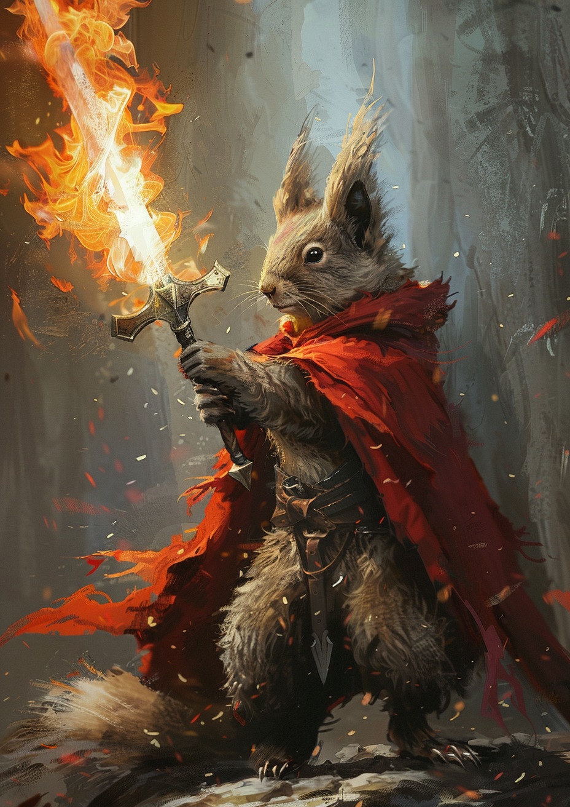

# Professor S

*Squirrel extraordinaire, doer of all things, lawful good*

> **Armor Class** 19 (Natural Armor)
> **Hit Points** 225 (18d12 + 108)
> **Speed** 40 ft., burrow 30 ft., fly 80 ft.
>
> | STR  | DEX  | CON  | INT  | WIS  | CHA  |
> |------|------|------|------|------|------|
> | 25   | 10   | 23   | 16   | 15   | 19   |
> | (+7) | (+0) | (+6) | (+3) | (+2) | (+4) |
> 
> **Saving Throws** DEX +5, CON +11, WIS +7, CHA +9
> **Skills** [Perception](https://www.dndbeyond.com/compendium/rules/basic-rules/using-ability-scores#Perception) +12, [Stealth](https://www.dndbeyond.com/compendium/rules/basic-rules/using-ability-scores#Stealth) +5
> **Damage Immunities** Lightning
> **Senses** [Blindsight](https://www.dndbeyond.com/compendium/rules/basic-rules/monsters#Blindsight) 60 ft., [Darkvision](https://www.dndbeyond.com/compendium/rules/basic-rules/monsters#Darkvision) 120 ft., Passive Perception 22
> **Languages** Common, Draconic
> **Challenge** 16 (15,000 XP)

***Legendary Resistance (3/Day).*** If the dragon fails a saving throw, it can choose to succeed instead.

#### Actions

***Multideploy.*** Prof S is helped you deploy your app on multiple disconnected systems.

***Crossplane.*** *Melee Weapon Attack:* +12 to hit, reach 10 ft., one target. *Hit:* 18 (2d10 + 7) piercing damage plus 5 (1d10) lightning damage.

***Argo Sync.*** *Melee Weapon Attack:* +12 to hit, reach 5 ft., one target. *Hit:* 14 (2d6 + 7) slashing damage.

***Tail.*** *Melee Weapon Attack:* view logs (I got nothing 🤷)

***Comforting Presence.*** Each dev on dev team gains +15 confidence and ships code within a month.

***Lightning Breath (Recharge 5–6).*** The dragon exhales lightning in a 90-­foot line that is 5 feet wide. Each creature in that line must make a DC 19 Dexterity saving throw, taking 66 (12d10) lightning damage on a failed save, or half as much damage on a successful one.

#### Legendary Actions

Prof S can take 3 legendary actions, choosing from the options below. Only one legendary action option can be used at a time and only at the end of another creature's turn. The dragon regains spent legendary actions at the start of its turn.

***Detect.*** The dragon makes a Wisdom ([Perception](https://www.dndbeyond.com/compendium/rules/basic-rules/using-ability-scores#Perception)) check.

***Tail Attack.*** The dragon makes a tail attack.

***Wing Attack (Costs 2 Actions).*** The dragon beats its wings. Each creature within 10 feet of the dragon must succeed on a DC 20 Dexterity saving throw or take 14 (2d6 + 7) bludgeoning damage and be knocked [prone](https://www.dndbeyond.com/compendium/rules/basic-rules/appendix-a-conditions#Prone). The dragon can then fly up to half its flying speed.